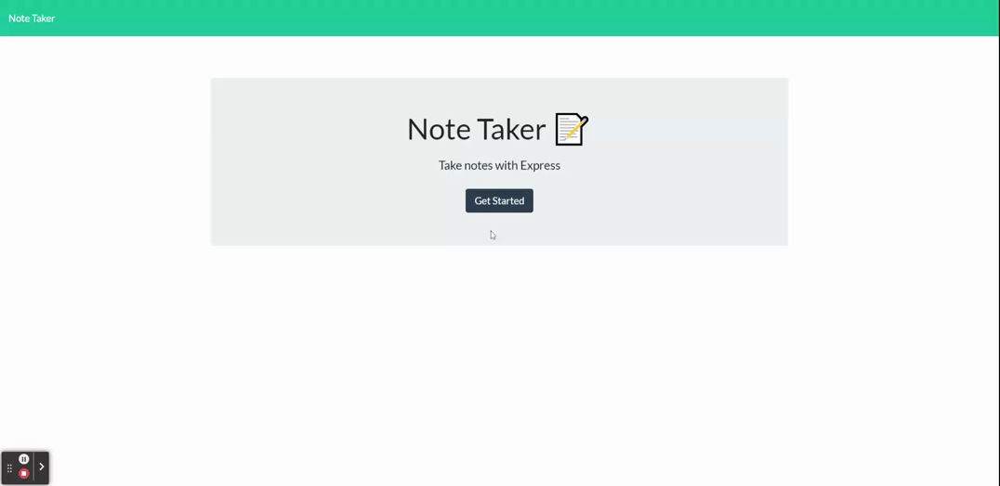

# Note Taker

## Description
- This project helps solve my problem of taking notes in one place and then not having access to those notes in another location
- I built this note taker to keep my notes all in one place for me to acess anywhere and at anytime
## Table of Contents
- [Installation](#installation)
- [Usage](#usage)
- [Credits](#credits)
- [License](#license)
## Installation
To install this project you can clone the repo, and npm install
## Usage
To use this project, run the server.js in a node environment
## Credits
Revivedaniel
## License
MIT
## How to Contribute
To contribute to this project, Message Revivedaniel
## Tests
To properly test this project, navigate to the /notes page. Then, click the + to add a new note. Type your title and message and press the save icon. Next, to delete a note press the red X on the note you wish to delete. Also, click each note on the left panel to see their note contents.
## Demo

## Live Site
https://note-taker-stark.herokuapp.com/
## Questions
* [gitHubLink](https://github.com/Revivedaniel)
* <a href="mailto:it-support@kth.se">webdevstark@gmail.com</a>